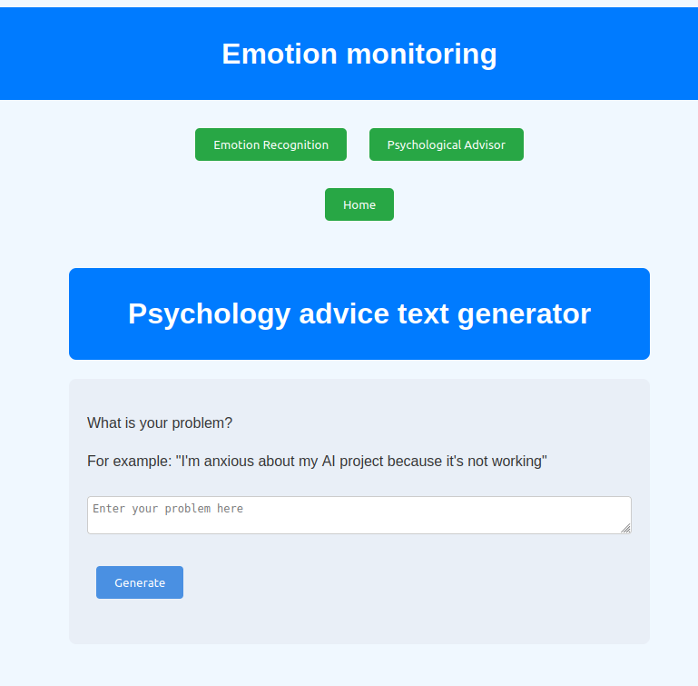

# Emotion Monitoring
A mix of main projects from my last year of engineering studies.
Click on a button to see projects.

## Emotion Recognition
This project is a deep learning algorithm that detects emotions by heart rate signals. 
**It's not working for now**
The code is adapted from [this code](https://github.com/joergsimon/SSL-ECG-Paper-Reimplementaton/tree/main) from [@joergsimon ](https://github.com/joergsimon). 

### How to use it 
- Click on **Emotion Recognition** button
- Follow instructions to set the ECG sensor
- Click on **Record ECG** button
- Heart rates are displayed on the right, and the detected emotion is shown on the bottom.

### How it works
All the code for this part is in the folder `emotion_recognition`. 
- `er.html` and `er.css` structure the website and make it friendly.
- `er.js` contains functions to identify the emotion thanks to ECG signals after clicking on the **Record ECG** button
- `model.onnx` contains weights of the emotion recognition algorithms. ***STILL IN PROCESS***

## Psychological advice text generator 
This part is a GPT-like, which gives you psychology advice according to the input text. 

**WARNING: This chatbot isn't a real solution if you suffer from psychological disorders!** It's just a student project. A real psychologist is a better solution. Take care of yourself :)

The project is based on the nanoGPT project from Karparthy (https://github.com/karpathy/nanoGPT).

<figcaption style="text-align: center; font-style: italic;">Main page of the psychology advice text generator</figcaption>

### How to use it 
- Click on **Psychological Advisor** button
- Write what is your problem on the input area
- Click on **Generate**
- Advice is generated, enjoy!

### How it works
All the code for this part is in the folder `psy_advisor`. 
- `psy_advisor.html` and `psy_advisor.css` structure the website and make it friendly.
- `psy_advisor.js` contains functions to generate the text after the click on **Generate** button
- `model.onnx` contains weights of the model. The code to make this file is inspired by the nanoGPT project from [Karparthy](https://github.com/karpathy/nanoGPT). You can find all the code [here](https://github.com/dianubv/psychology_chatbot).

## Relating waves
I add a link to a little game. It's another project I made with three.js. The code is [here](https://github.com/dianubv/RelaxingWaves)

## Contact
If you have questions, ask me ;)
